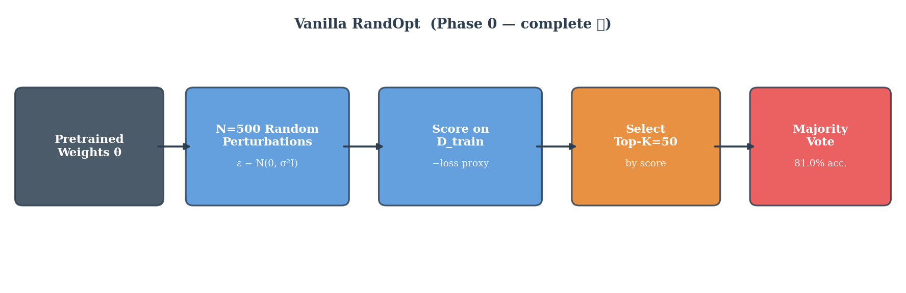
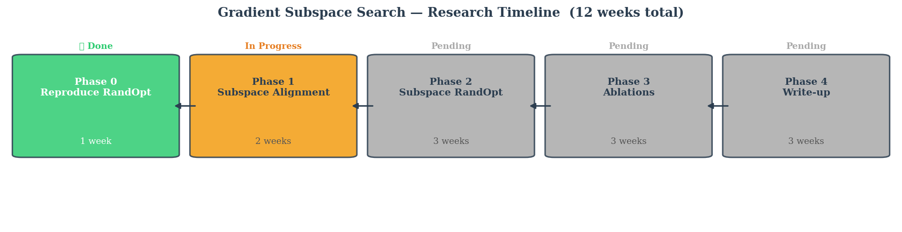
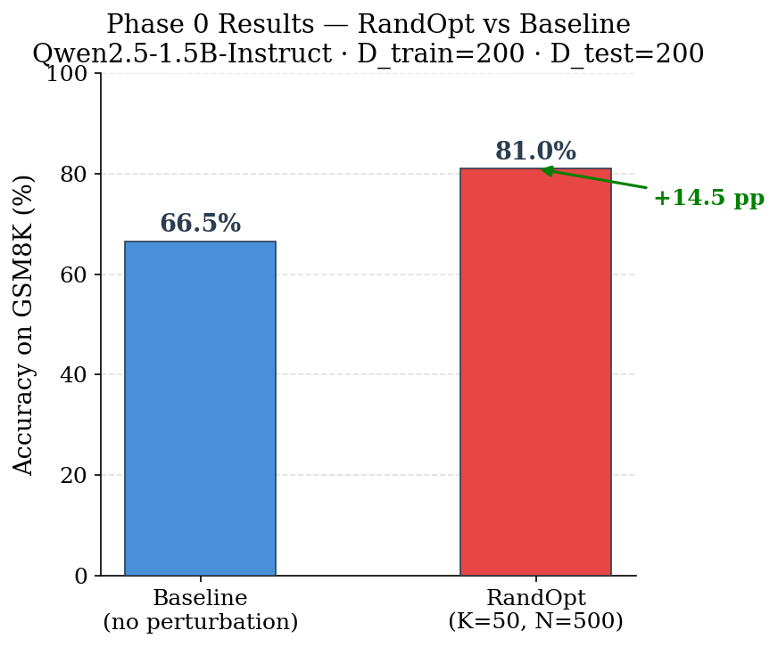
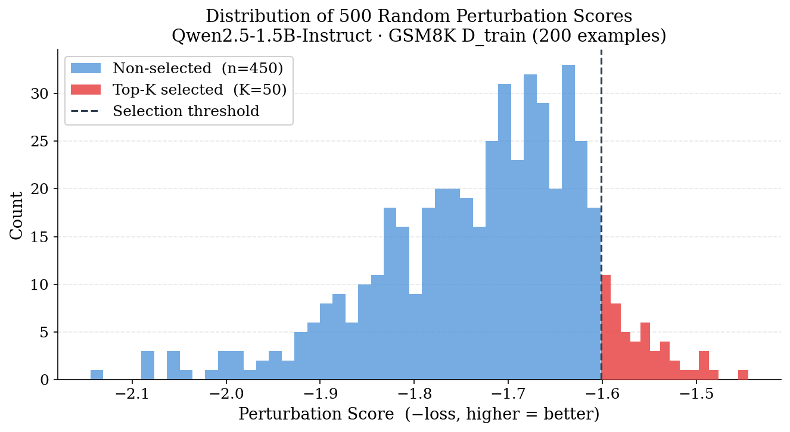
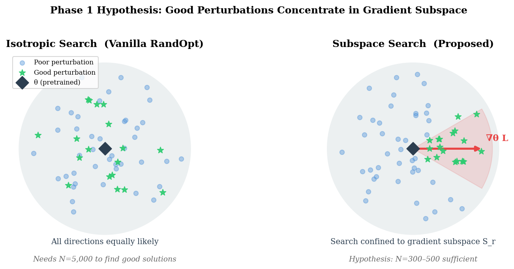

# Gradient Subspace Search: Compute-Efficient Post-Training via Low-Dimensional Weight Perturbation

**Esteban Schafir · FIU Research · June 2026**

---

## 1. Motivation

Post-training large language models (LLMs) typically requires sequential gradient-based
optimization — PPO, GRPO — which is expensive and requires backpropagation through thousands
of update steps. Gan & Isola (2026) recently challenged this assumption with a surprising
empirical finding: **in sufficiently large pretrained models, task-improving weight
perturbations are already dense around the pretrained initialization**, making gradient-free
random search competitive with standard RL-based post-training.

Their algorithm, **RandOpt**, exploits this by sampling N=5,000 random Gaussian weight
perturbations, selecting the top-K by performance on a small training set, and ensembling
predictions via majority vote — with no gradient steps at all.

**The bottleneck:** Despite requiring no backpropagation, RandOpt needs N=5,000 independent
forward passes, demanding hundreds of GPUs running in parallel. Most practitioners cannot
replicate these results.

**Our proposal:** The Neural Thickets paper also notes that LLM fine-tuning landscapes exhibit
*low-dimensional curvature* — only a small number of directions in weight space drive reward
improvements. We ask:

> **Do the top-K perturbations found by RandOpt concentrate in the gradient subspace of the task reward — and if so, can searching directly in this subspace reduce N by 10×?**

If confirmed, the total cost becomes one backward pass (subspace construction) plus ~500 forward
passes — accessible on a **single GPU**.

---

## 2. Background: Neural Thickets

Gan & Isola (2026) introduce two key measures:

**Solution density** δ(m): the probability that a random Gaussian perturbation improves task
performance by margin m. Empirical finding: δ scales monotonically with model size.

| Model Size | δ(0) on GSM8K |
|---|---|
| Qwen2.5-0.5B | ~0% |
| Qwen2.5-1.5B | ~18% |
| Qwen2.5-3B   | ~37% |
| Qwen2.5-32B  | ~64% |

**Spectral discordance** 𝒟: measures how diverse the top-K perturbations are across tasks.
High 𝒟 means different perturbations specialize in different tasks, which is what makes
majority-vote ensembling effective.

**RandOpt algorithm:**

---

## 3. Our Proposed Method: Subspace RandOpt

**Key insight:** instead of sampling isotropically in R^d (d ~ 1.5 billion dimensions), we
restrict search to the low-dimensional gradient subspace S_r (r ~ 100 dimensions).

**How we build the subspace:**
1. Compute gradient g = ∇_θ L(θ, D_loc) on a small localization set (50 examples) — one backward pass
2. Reshape g into a matrix G ∈ R^{m×n}, compute truncated SVD to get top-r left/right singular vectors U_r, V_r
3. A subspace perturbation is Δ = σ · vec(U_r diag(z) V_r^T), z ~ N(0, I_r)

**Why fewer samples suffice:** reducing search from d ~ 1.5B to r ~ 100 dimensions means
N_subspace ≈ N_full × √(r/d) ≈ 300–500 instead of 5,000.

**Comparison:**

| Method | Search space | N | Backprop steps | Target acc. (GSM8K) |
|---|---|---|---|---|
| GRPO (200 steps) | — | — | 200 | ~82% |
| RandOpt (N=5000) | R^d | 5,000 | 0 | ~87% |
| RandOpt (N=500)  | R^d | 500 | 0 | lower |
| **Subspace RandOpt** | S_r ⊂ R^d | 300–500 | **1** | ~87%? |

---

## 4. Experimental Plan

**Models:** Qwen2.5-1.5B-Instruct (primary), Qwen2.5-3B-Instruct (secondary)

**Benchmarks:** GSM8K mathematical reasoning (primary), Countdown (secondary), MBPP code generation

**Phases:**

| Phase | Goal | Status |
|---|---|---|
| 0 — Reproduce | Vanilla RandOpt baseline on GSM8K | ✅ Complete |
| 1 — Verify | Does gradient subspace alignment hold? | 🔄 In Progress |
| 2 — Method | Subspace RandOpt vs. isotropic at equal N | ⏳ Pending |
| 3 — Ablations | Rank r, basis choice, D_loc size, task transfer | ⏳ Pending |
| 4 — Write-up | Paper draft | ⏳ Pending |

---

## 5. Phase 0 Results — Reproducing RandOpt

**Setup:** Qwen2.5-1.5B-Instruct, N=500, K=50, D_train=200, D_test=200 (GSM8K)

**Results:**

| Method | Accuracy |
|---|---|
| Baseline (no perturbation) | 66.50% |
| RandOpt K=50, N=500 | **81.00%** |
| Improvement | **+14.5 pp** |

The result is consistent with the Neural Thickets paper (reports ~76–80% for 1.5B at K=50),
confirming that:
1. The model is in the "thicket regime" — many good perturbations exist nearby
2. Majority vote ensembling provides substantial gains over baseline

**Score distribution across 500 perturbations:**

The histogram shows that the top-50 selected perturbations (red) clearly separate from
the bulk of the distribution, validating the selection procedure.

**Note on scoring:** perturbation selection used teacher-forced loss as a proxy score
(faster than generation). Final majority vote accuracy used real autoregressive generation.
The 14.5 pp improvement is a genuine generation-based accuracy number.

---

## 6. Phase 1 — Subspace Alignment Verification

**The core hypothesis (H2):** The perturbation deltas Δ_i = θ'_i − θ of the top-K models
selected by RandOpt have significantly higher projection energy onto the gradient subspace
S_r than randomly selected perturbations of equal norm.

**Measured by subspace energy ratio:**

ρ_r(Δ) = ||P_r^T Δ||² / ||Δ||²

where P_r is the d×r subspace basis (columns = vec(u_j ⊗ v_j) from SVD of reshaped gradient).

**What we measure:**
- ρ̄⁺: mean ratio for top-K deltas
- ρ̄⁻: mean ratio for K random non-top deltas
- Ratio ρ̄⁺ / ρ̄⁻: if ≥ 2× at rank r ≤ 200 → proceed to Phase 2

**Conceptual illustration:**

**Decision gate:**

| Result | Interpretation | Action |
|---|---|---|
| ρ̄⁺ ≥ 2× ρ̄⁻ at r ≤ 200 | Alignment holds | Proceed to Phase 2 |
| ρ̄⁺ ≈ ρ̄⁻ | Gradient is wrong basis | Test Fisher diagonal or PCA of top-K deltas |
| Gap only for r > 500 | Subspace too high-dimensional | Test layerwise gradient subspaces |

---

## 7. Phase 1 Results

The Phase 1 subspace alignment verification was run on Qwen-1.5B-Instruct using $D_{\text{loc}} = 50$ SFT examples for gradient localization and $K = 50$ top perturbations from Phase 0. 

**Gradient Localization:**
*   Gradient norm on $D_{\text{loc}}$: **11.6879**

**Subspace Energy Ratio ($\rho_r$) Results:**

| Rank $r$ | $\bar{\rho}^+$ (Top-$K$) | $\bar{\rho}^-$ (Non-Top) | Ratio $\bar{\rho}^+ / \bar{\rho}^-$ | Status |
|---|---|---|---|---|
| 10 | $5.915 \times 10^{-9}$ | $6.413 \times 10^{-9}$ | 0.92x | ✗ weak |
| 50 | $3.297 \times 10^{-8}$ | $3.135 \times 10^{-8}$ | 1.05x | ✗ weak |
| 100 | $6.328 \times 10^{-8}$ | $6.484 \times 10^{-8}$ | 0.98x | ✗ weak |
| 200 | $1.281 \times 10^{-7}$ | $1.284 \times 10^{-7}$ | 1.00x | ✗ weak |
| 500 | $3.247 \times 10^{-7}$ | $3.210 \times 10^{-7}$ | 1.01x | ✗ weak |

**Decision Gate:**
*   Best Ratio: **1.05x** (at rank 50) $\rightarrow$ **INVESTIGATE_ALTERNATIVE_BASIS**

The alignment is extremely close to the theoretical isotropic random projection expectation of $r/d$. The decision gate output indicates that SFT gradient SVD is not a viable subspace basis for Subspace RandOpt, requiring the investigation of alternative bases (such as PCA of top-K deltas, layer-wise SVD, or parameter-sparse Fisher diagonal).

---

## 8. Risks and Mitigations

| Risk | Mitigation |
|---|---|
| Alignment fails (ρ̄⁺ ≈ ρ̄⁻) | Switch to empirical Fisher or PCA of top-K deltas; report as finding about RandOpt geometry |
| Subspace search collapses specialist diversity | Measure spectral discordance 𝒟 vs. rank r; report Pareto frontier |
| Performance gap vs. full RandOpt is large | Compare at equal FLOPs; one backward pass buys compute savings even with accuracy gap |

---

## 9. Expected Contributions

1. **Empirical finding (Phase 1):** First direct measurement of whether RandOpt's top-K perturbations align with the task gradient subspace — a question the original paper raises but does not answer.

2. **Subspace RandOpt (Phase 2):** A method achieving comparable accuracy to vanilla RandOpt with 10× fewer perturbation evaluations and a single backward pass.

3. **Practical impact:** Effective post-training on a single GPU, removing the cluster-scale compute requirement of the original method.

---

*Generated from experimental results in `results/`. Run `python reports/generate_figures.py` to regenerate figures.*
